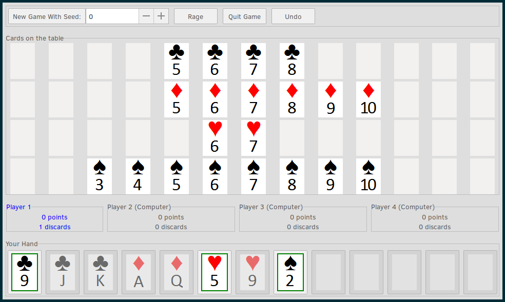

# straights-gtk

[](https://opensource.org/licenses/MIT)
[](https://opensource.org/licenses/Apache-2.0)


A modular implementation of the Straights card game using GTK+ 3.

## Installation

### Dependencies

 - `libgtkmm-3.0-dev`

### Building

```
git clone https://gitlab.com/jeffrey-xiao/straights-gtk
cd straights-gtk
make
./straights
```

## License

`straights-gtk` is distributed under the terms of both the MIT License and the Apache License
(Version 2.0).

See [LICENSE-APACHE](LICENSE-APACHE) and [LICENSE-MIT](LICENSE-MIT) for more details.
